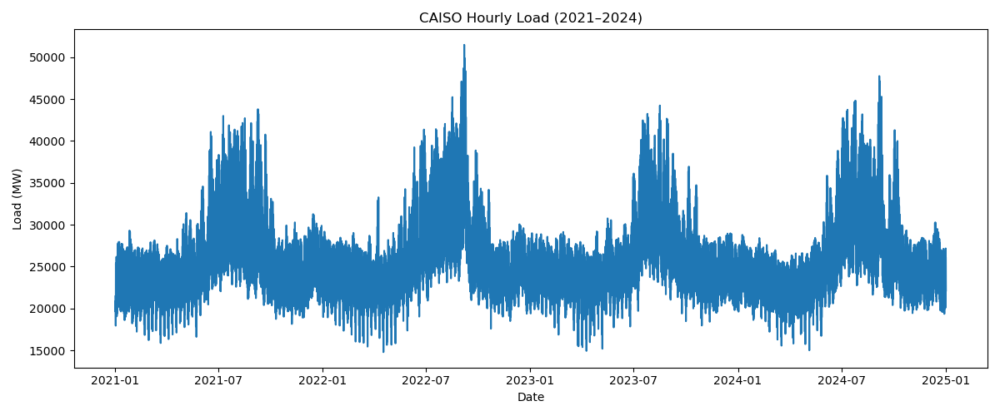
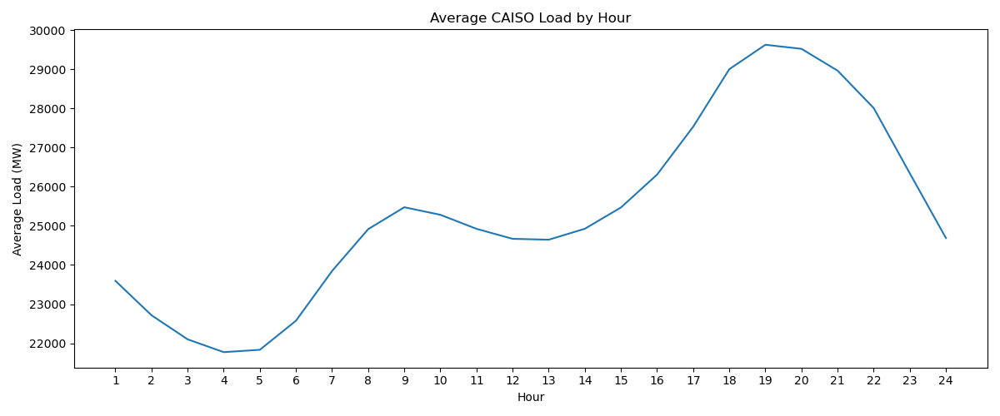
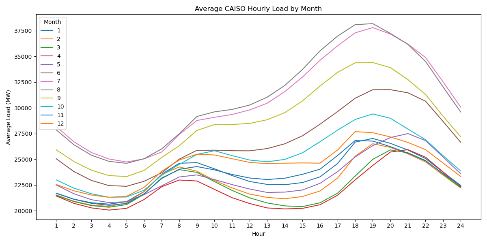
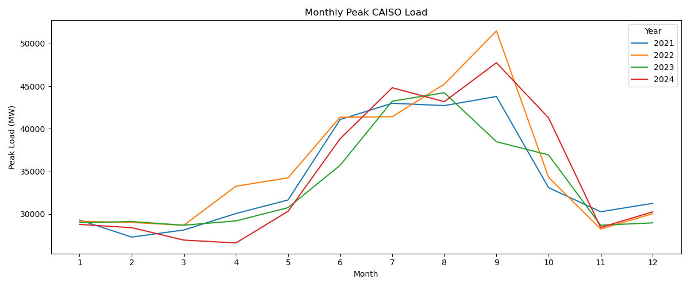
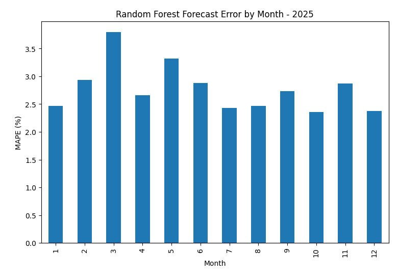
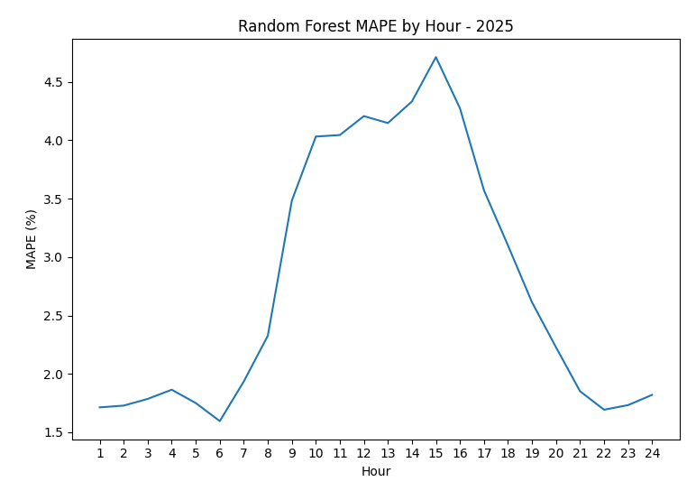
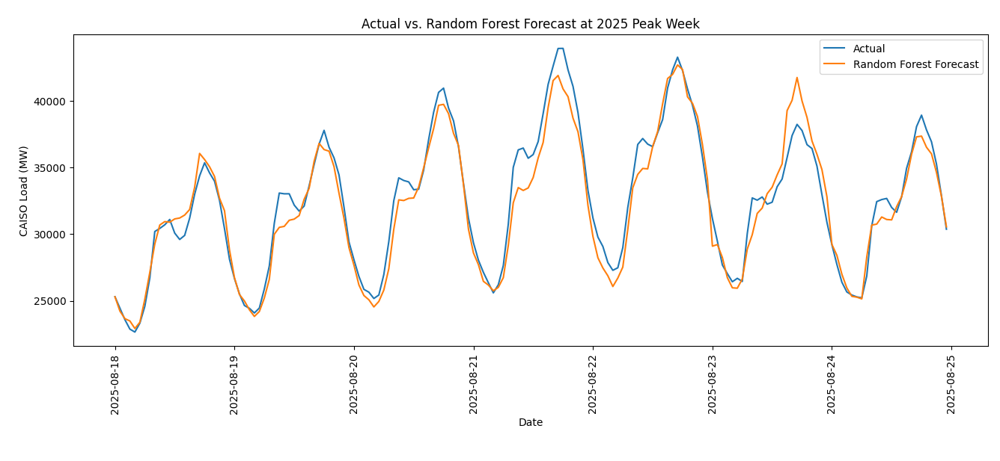

# CAISO Hourly Load Forecasting

## Project Overview
This project develops and evaluates hourly electricity load forecasting models for the California Independent System Operator (CAISO). Using historical CAISO load (in MW), calendar effects, and hourly weather observations from selected cities across California, I compared seasonal-naive benchmarks, regression approaches, a regional level model, and a Random Forest model.

To build the initial models, 2021–2023 CAISO data was used for training and 2024 as an out-of-sample test year. After comparing model performance, the best initial models were retrained using data through 2024 and evaluated against a separate 2025 holdout year.

The final Random Forest was the best performing model which was evaluated on Mean Absolute Error (MAE), Root Mean Squared Error (RMSE), and Mean Absolute Percentage Error (MAPE):
- **MAE:** 717 MW
- **RMSE:** 1,012 MW
- **MAPE:** 2.77%

Forecast accuracy by month, hour, and high-demand periods were generated to identify where the model succeeds and fails at a more granular level than the previously described aggregated evaluation metrics.

## Data
Hourly CAISO load data cover 2021–2025 and include system load as well as load for the major CAISO service territories:

- Pacific Gas & Electric (PG&E)
- Southern California Edison (SCE)
- San Diego Gas & Electric (SDG&E)
- Valley Electric Association (VEA)

Historical weather data were retrieved from the Open-Meteo archive API ([link](https://open-meteo.com/)) for several California locations:

- Sacramento
- San Jose
- Fresno
- Los Angeles
- Riverside
- San Diego
- Poway

Hourly temperature observations were merged with CAISO load data by timestamp.

## Exploratory Analysis
As expected CAISO load displays strong daily and seasonal structure.



System demand follows a highly repetitive intraday pattern. Average load increases during the morning, exhibits substantial seasonal variation during daytime hours, and rises again toward the evening.



The shape of the daily load curve also varies significantly by season. Summer months exhibit much stronger afternoon demand, while several winter and spring months show a more pronounced midday decline.



Monthly peak demand shows substantial yearly variability, including the extreme event on September 6, 2022 where total system load peaked above 51,000 MW.



These patterns motivated the use of calendar effects, seasonal interactions, lagged load, and regional weather predictors in subsequent forecasting models.

## Time-Series Diagnostics
CAISO load exhibits strong temporal dependence.

| Lag | Correlation |
|---:|---:|
| 1 hour | 0.974 |
| 24 hours | 0.929 |
| 48 hours | 0.847 |
| 168 hours | 0.839 |

The particularly strong 24-hour correlation indicates that load from the same hour on the previous day provides substantial information for short-term forecasting. Weekly load also remains highly correlated.

ADF and KPSS stationarity tests produced different conclusions. The ADF test strongly rejected a unit root, while the KPSS test rejected level stationarity. Combined with the ACF and exploratory plots, these results are consistent with a series containing strong deterministic daily, weekly, and seasonal structure.

Daily and weekly lag variables were therefore incorporated directly into the forecasting models.

---

## Forecasting Approach

Model development followed a chronological evaluation design:

**2021–2023 training data → 2024 model comparison → retrain through 2024 → 2025 final holdout validation**

### Seasonal-Naive Benchmarks
Two simple benchmarks were first evaluated:

$$
\hat{L}_t^{(24)} = L_{t-24}
$$

and

$$
\hat{L}_t^{(168)} = L_{t-168}
$$

The 24-hour seasonal-naive forecast substantially outperformed the weekly benchmark and provided the main baseline for evaluating more sophisticated models.

### Regression Models
The first regression models incorporated:

- hour of day
- day of week
- month
- 24-hour lagged load
- 168-hour lagged load

An hour-by-month interaction was then introduced because exploratory analysis showed that the intraday load profile changes substantially across seasons.

Hourly temperature observations were subsequently added to capture weather-related load variation.

### Regional level Model
Because California weather and electricity demand vary geographically, separate regression models were developed for the major CAISO service territories.

Regional forecasts used service-territory-specific lagged loads and weather observations from representative cities. The individual regional forecasts were then summed to produce a bottom-up CAISO system forecast.

### Random Forest
A Random Forest was used as a nonlinear forecasting model with the following predictors:

- hour
- day of week
- month
- 24-hour load lag
- 168-hour load lag
- hourly temperatures across seven California locations

Unlike the regression models, the Random Forest can capture nonlinear relationships and interactions without explicitly specifying their functional form.

The 24-hour lag was by far the model's most important predictor, consistent with the strong daily autocorrelation observed during the time-series analysis.

---

## 2024 Model Development Results
Models were initially compared using 2024 as an out-of-sample test year after training on 2021–2023 data.

| Model | MAE (MW) | RMSE (MW) |
|---|---:|---:|
| 168-hour seasonal naive | 1,859 | 2,826 |
| 24-hour seasonal naive | 1,288 | 1,847 |
| Basic OLS | 995 | 1,382 |
| OLS + Hour × Month | 988 | 1,373 |
| OLS + Weather | 954 | 1,302 |
| Regional Bottom-Up OLS | 849 | 1,132 |
| **Random Forest** | **773** | **1,104** |

The Random Forest produced the lowest MAE and RMSE during model development. Its MAE was approximately **40% lower than the 24-hour seasonal-naive benchmark**.

The regional bottom-up model also performed substantially better than the aggregate weather regression, suggesting that explicitly modeling geographic differences in load and weather provided useful predictive information.

## Final 2025 Holdout Validation
After model development, the regional OLS and Random Forest approaches were retrained using data through 2024 and evaluated on the separate 2025 holdout year.

| Model | MAE (MW) | RMSE (MW) | MAPE |
|---|---:|---:|---:|
| Regional Bottom-Up OLS | 815 | 1,098 | 3.20% |
| **Random Forest** | **717** | **1,012** | **2.77%** |

The Random Forest remained the strongest model on the 2025 holdout data, reducing MAE by approximately **12%** relative to the regional OLS model.

Its 2025 performance was also similar to—and slightly better than—its 2024 test-year performance, providing evidence that the model generalized well to a subsequent year.


## Forecast Error Analysis
Average forecast accuracy varied considerably by season and hour.

### Error by Month


Monthly MAPE ranged from approximately 2.36% to 3.80%.

- Lowest MAPE: October - 2.36%
- Highest MAPE: March — 3.80%

March and May produced larger errors than most summer and winter months, suggesting that transitional periods may be more difficult to forecast.

### Error by Hour


Forecast accuracy was highest overnight and early in the morning. MAPE increased substantially during daytime and afternoon hours.

- Lowest hourly MAPE: 06:00 — **1.60**%
- Highest hourly MAPE: 15:00 — **4.71**%

The model therefore performs substantially better during relatively stable overnight periods than during the more variable daytime load cycle.

### Performance During High-Demand Periods
Across the top 5% of 2025 load hours:

| Metric | Result |
|---|---:|
| Load threshold | 33,963 MW |
| MAE | 1,135 MW |
| RMSE | 1,431 MW |
| MAPE | 3.12% |

Errors increased during high-demand periods relative to overall 2025 performance, indicating that extreme load conditions remain more difficult to predict.

The annual system peak occurred on August 21, 2025 at 19:00:

- Actual load: **43,923 MW**
- Random Forest forecast: **40,884 MW**
- Underforecast: **3,039 MW**
- Percentage error: **6.92%**



Although the model tracks the overall load pattern during the peak week, the annual maximum illustrates the increased difficulty of accurately forecasting extreme demand.

## Key Findings
1. Recent load is the strongest predictor of near-term CAISO demand. Load at the same hour one day earlier had a correlation of 0.93 with current load and dominated Random Forest feature importance.

2. Calendar and seasonal effects materially improve on simple persistence forecasts. Regression models reduced forecast error by more than 20% relative to the 24-hour seasonal-naive benchmark.

3. Weather improves forecast accuracy. Adding hourly temperature observations further reduced both MAE and RMSE.

4. Regional modeling adds predictive value. Modeling major service territories separately produced substantially lower forecast error than a single aggregate weather regression.

5. The Random Forest produced the strongest overall performance. It achieved a 2025 holdout MAPE of **2.77%**.

6. Forecast performance deteriorates during the most operationally important periods. Errors were larger during high-demand hours, including a 6.92% underforecast at the 2025 annual system peak.

## Limitations
Models using weather features in this project use realized hourly weather observations rather than historical weather forecasts.

The reported results should therefore be interpreted as weather-conditioned forecast performance, rather than a complete reconstruction of CAISO's historical day-ahead forecasting methodology.

An operational forecasting system would replace observed future temperatures with weather forecasts available at the time each load forecast is produced, and certainly include inputs from more weather stations than the 7 samples used for this project.

## Tools
- Python
- pandas
- NumPy
- statsmodels
- scikit-learn
- matplotlib
- Open-Meteo API

## Repository Structure
```text
CAISO_load_forecasting/
│
├── data/
│   ├── caiso_loads/
│   │   ├── raw/
│   │   └── cleaned/
│   └── weather/
│
├── output/
│
├── src/
│   ├── 01_clean_raw_loads.py
│   ├── 02_EDA.py
│   ├── 03_time_series_diagnostics.py
│   ├── 04_base_forecasts.py
│   ├── 05_econometric_model.py
│   ├── 06_weather_input.py
│   ├── 07_weather_model.py
│   ├── 08_regional_weather_input.py
│   ├── 09_regional_model.py
│   ├── 10_random_forest_model.py
│   ├── 11_validation_cleaning.py
│   ├── 12_regional_2025_weather_input.py
│   ├── 13_final_validation.py
│   └── 14_forecast_error_analysis.py
│
└── README.md
```